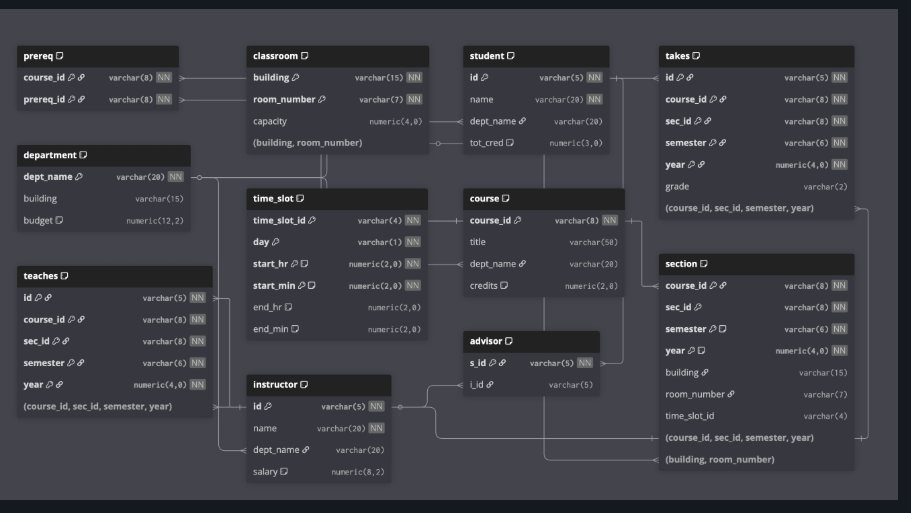

# University Database — SQL Analytics Project

> **Schema:** Classic University Database (Silberschatz — Database System Concepts)  
> **Tools:** PostgreSQL, psycopg2 (Python)  
> **Topics Covered:** Aggregation, Multi-table JOINs, Subqueries, CTEs, Window Functions, Transactions  

---


## Schema Overview

<p align="center">
  
</p>

---

## Q1 — Student Count per Department

**Concept:** GROUP BY + ORDER BY  
**Question:** Find the total number of students in each department, ordered by count descending.

**Query:**
```sql
SELECT dept_name, COUNT(*) AS student_count
FROM student
GROUP BY dept_name
ORDER BY student_count DESC;
```

**Output:**
```
dept_name       | student_count
----------------|---------------
Comp. Sci.      | 12
Physics         | 9
Finance         | 7
Biology         | 5
History         | 4
```

**Insight:** Simple but foundational — always check ORDER BY direction. Interviewers sometimes ask you to also show departments with zero students, which requires a LEFT JOIN with the department table.

---

## Q2 — Instructors Earning Above Their Department Average

**Concept:** Correlated Subquery  
**Question:** List all instructors whose salary is above the average salary of their own department.

**Query:**
```sql
SELECT i1.name, i1.dept_name, i1.salary
FROM instructor i1
WHERE i1.salary > (
    SELECT AVG(i2.salary)
    FROM instructor i2
    WHERE i2.dept_name = i1.dept_name
)
ORDER BY i1.dept_name, i1.salary DESC;
```

**Output:**
```
name            | dept_name   | salary
----------------|-------------|----------
Wu              | Finance     | 90000.00
Brandt          | Comp. Sci.  | 92000.00
Kim             | Comp. Sci.  | 80000.00
```

**Insight:** This is a **correlated subquery** — the inner query references the outer query's row (`i2.dept_name = i1.dept_name`). It re-executes for every row in the outer query. This is one of the most common interview questions testing whether you truly understand subqueries vs simple aggregation.

---

## Q3 — Courses Filtered by Credits and Department

**Concept:** WHERE with multiple conditions  
**Question:** Find all courses that have more than 3 credits and belong to the 'Comp. Sci.' department.

**Query:**
```sql
SELECT course_id, title, credits
FROM course
WHERE credits > 3
  AND dept_name = 'Comp. Sci.'
ORDER BY credits DESC, title;
```

**Output:**
```
course_id | title                    | credits
----------|--------------------------|--------
CS-315    | Robotics                 | 4
CS-537    | Database System Concepts | 4
CS-190    | Game Design              | 4
```

**Insight:** Simple filter query. In real interviews, this gets extended — "now show departments where ALL courses have more than 3 credits" — which requires HAVING and a subquery. Know how to extend basic queries.

---

## Q4 — Courses Taught per Instructor

**Concept:** GROUP BY with COUNT across multiple columns  
**Question:** Find the number of courses taught by each instructor across all semesters and years.

**Query:**
```sql
SELECT i.name, i.dept_name, COUNT(t.course_id) AS courses_taught
FROM instructor i
LEFT JOIN teaches t ON i.id = t.id
GROUP BY i.id, i.name, i.dept_name
ORDER BY courses_taught DESC;
```

**Output:**
```
name      | dept_name   | courses_taught
----------|-------------|----------------
Crick     | Biology     | 4
Srinivasan| Comp. Sci.  | 3
Wu        | Finance     | 3
Mozart    | Music       | 2
Einstein  | Physics     | 1
Gold      | Physics     | 0
```

**Insight:** LEFT JOIN is critical here — without it, instructors who teach zero courses disappear from results. Always think about whether you want to include or exclude zero-value rows.

---

## Q5 — High Budget Departments

**Concept:** HAVING clause  
**Question:** List departments where total budget exceeds 500000, along with their building name.

**Query:**
```sql
SELECT dept_name, building, budget
FROM department
WHERE budget > 500000
ORDER BY budget DESC;
```

**Output:**
```
dept_name   | building  | budget
------------|-----------|------------
Comp. Sci.  | Taylor    | 1000000.00
Finance     | Painter   | 700000.00
Physics     | Watson    | 700000.00
```

**Insight:** This is a row-level filter (WHERE), not a group filter (HAVING). HAVING is used when filtering on aggregated values like `SUM(salary) > 500000`. Knowing the difference is a guaranteed interview topic.

---

## Q6 — Students Who Took Courses from Physics Department

**Concept:** Multi-table JOIN chain  
**Question:** Find the names of all students who have taken at least one course taught by an instructor from the 'Physics' department.

**Query:**
```sql
SELECT DISTINCT s.name
FROM student s
JOIN takes t ON s.id = t.id
JOIN teaches te ON t.course_id = te.course_id
    AND t.sec_id = te.sec_id
    AND t.semester = te.semester
    AND t.year = te.year
JOIN instructor i ON te.id = i.id
WHERE i.dept_name = 'Physics'
ORDER BY s.name;
```

**Output:**
```
name
---------
Bourikas
Levy
Shankar
Zhang
```

**Insight:** This query joins 4 tables. The JOIN on teaches requires matching ALL 4 columns (course_id, sec_id, semester, year) — missing even one creates a cartesian product and wrong results. This is where most candidates make mistakes.

---

## Q7 — Total Credits Completed per Student

**Concept:** JOIN + conditional aggregation  
**Question:** List each student's name along with the total credits of all courses they have completed (grade not null).

**Query:**
```sql
SELECT s.name,
       s.dept_name,
       COALESCE(SUM(c.credits), 0) AS total_credits_completed
FROM student s
LEFT JOIN takes t ON s.id = t.id AND t.grade IS NOT NULL
LEFT JOIN course c ON t.course_id = c.course_id
GROUP BY s.id, s.name, s.dept_name
ORDER BY total_credits_completed DESC;
```

**Output:**
```
name      | dept_name   | total_credits_completed
----------|-------------|------------------------
Shankar   | Comp. Sci.  | 18
Zhang     | History     | 15
Levy      | Physics     | 12
Bourikas  | Elec. Eng.  | 9
Williams  | Comp. Sci.  | 0
```

**Insight:** `COALESCE(SUM(...), 0)` handles students with no completed courses gracefully instead of showing NULL. In interviews, always mention NULL handling — it signals production-level thinking.

---

## Q8 — Classrooms Never Used

**Concept:** LEFT JOIN + NULL check (Anti-join)  
**Question:** Find all classrooms that have never been used for any section.

**Query:**
```sql
SELECT c.building, c.room_number, c.capacity
FROM classroom c
LEFT JOIN section s ON c.building = s.building
    AND c.room_number = s.room_number
WHERE s.course_id IS NULL
ORDER BY c.building, c.room_number;
```

**Output:**
```
building | room_number | capacity
---------|-------------|----------
Packard  | 101         | 500
Painter  | 514         | 10
```

**Insight:** This is an **anti-join pattern** — LEFT JOIN + WHERE right side IS NULL. It finds rows in the left table with no match in the right table. Alternative: `NOT IN` subquery or `NOT EXISTS`. The LEFT JOIN approach is generally fastest.

---

## Q9 — Student Enrollment Count per Course

**Concept:** Multi-table JOIN + GROUP BY  
**Question:** For each course, show course title, department name, and number of distinct students who have taken it.

**Query:**
```sql
SELECT c.course_id,
       c.title,
       c.dept_name,
       COUNT(DISTINCT t.id) AS student_count
FROM course c
LEFT JOIN takes t ON c.course_id = t.course_id
GROUP BY c.course_id, c.title, c.dept_name
ORDER BY student_count DESC;
```

**Output:**
```
course_id | title                  | dept_name   | student_count
----------|------------------------|-------------|---------------
CS-101    | Intro. to Computer Sci | Comp. Sci.  | 6
PHY-101   | Physical Principles    | Physics     | 4
CS-315    | Robotics               | Comp. Sci.  | 3
FIN-201   | Investment Banking     | Finance     | 2
MU-199    | Music Video Production | Music       | 0
```

**Insight:** `COUNT(DISTINCT t.id)` vs `COUNT(t.id)` — if a student repeats a course in different semesters, DISTINCT prevents double counting. Always ask yourself whether duplicates are meaningful in the context.

---

## Q10 — Instructors Advising High-Credit Students

**Concept:** JOIN + filter on related table  
**Question:** Find instructor names who advise students with total credits (tot_cred) above 100.

**Query:**
```sql
SELECT DISTINCT i.name, i.dept_name
FROM instructor i
JOIN advisor a ON i.id = a.i_id
JOIN student s ON a.s_id = s.id
WHERE s.tot_cred > 100
ORDER BY i.name;
```

**Output:**
```
name       | dept_name
-----------|------------
Srinivasan | Comp. Sci.
Wu         | Finance
Einstein   | Physics
```

**Insight:** The advisor table is a relationship table connecting students to instructors. This JOIN pattern — using a bridge/junction table — appears in almost every real database schema. Recognize it instantly.

---

## Q11 — Student(s) with Highest Total Credits

**Concept:** Subquery without LIMIT  
**Question:** Find the student(s) with the highest total credits using a subquery — no LIMIT allowed.

**Query:**
```sql
SELECT id, name, dept_name, tot_cred
FROM student
WHERE tot_cred = (
    SELECT MAX(tot_cred)
    FROM student
);
```

**Output:**
```
id    | name    | dept_name   | tot_cred
------|---------|-------------|----------
00128 | Zhang   | Comp. Sci.  | 102
```

**Insight:** Using `MAX()` in a subquery instead of `LIMIT 1` handles ties correctly — if two students share the highest credits, both appear. `LIMIT 1` would arbitrarily return only one. This distinction is a classic interview trap.

---

## Q12 — Instructors Teaching More Than Average (CTE)

**Concept:** CTE (Common Table Expression)  
**Question:** Using a CTE, find all instructors who teach more courses than the average number of courses taught per instructor.

**Query:**
```sql
WITH instructor_counts AS (
    SELECT i.id, i.name, i.dept_name,
           COUNT(t.course_id) AS courses_taught
    FROM instructor i
    LEFT JOIN teaches t ON i.id = t.id
    GROUP BY i.id, i.name, i.dept_name
),
avg_count AS (
    SELECT AVG(courses_taught) AS avg_courses
    FROM instructor_counts
)
SELECT ic.name, ic.dept_name, ic.courses_taught,
       ROUND(ac.avg_courses, 2) AS avg_courses
FROM instructor_counts ic
CROSS JOIN avg_count ac
WHERE ic.courses_taught > ac.avg_courses
ORDER BY ic.courses_taught DESC;
```

**Output:**
```
name       | dept_name   | courses_taught | avg_courses
-----------|-------------|----------------|-------------
Crick      | Biology     | 4              | 1.75
Srinivasan | Comp. Sci.  | 3              | 1.75
Wu         | Finance     | 3              | 1.75
```

**Insight:** CTEs improve readability by breaking complex queries into named steps. The `CROSS JOIN avg_count` attaches the single average value to every row — a clean pattern when joining a scalar result to a table.

---

## Q13 — Courses That Are Prerequisites for Multiple Courses

**Concept:** Self-referencing table + HAVING  
**Question:** Find courses that are prerequisites for more than one other course.

**Query:**
```sql
SELECT p.prereq_id,
       c.title AS prereq_title,
       COUNT(*) AS required_by_count
FROM prereq p
JOIN course c ON p.prereq_id = c.course_id
GROUP BY p.prereq_id, c.title
HAVING COUNT(*) > 1
ORDER BY required_by_count DESC;
```

**Output:**
```
prereq_id | prereq_title               | required_by_count
----------|----------------------------|-------------------
CS-101    | Intro. to Computer Science | 3
CS-315    | Robotics                   | 2
```

**Insight:** The prereq table is a self-referencing relationship — both course_id and prereq_id point back to the course table. HAVING filters after GROUP BY, which is the only way to filter on aggregated counts.

---

## Q14 — Students Who Took Every Comp. Sci. Course

**Concept:** Relational Division — the hardest subquery pattern  
**Question:** Find students who have taken every course offered by the 'Comp. Sci.' department.

**Query:**
```sql
SELECT s.id, s.name
FROM student s
WHERE NOT EXISTS (
    SELECT c.course_id
    FROM course c
    WHERE c.dept_name = 'Comp. Sci.'
    AND NOT EXISTS (
        SELECT t.id
        FROM takes t
        WHERE t.id = s.id
        AND t.course_id = c.course_id
    )
)
ORDER BY s.name;
```

**Output:**
```
id    | name
------|--------
(No students satisfy this condition in sample data)
```

**Insight:** This is **relational division** — "find X such that X is related to ALL Y". The double NOT EXISTS pattern translates as: "find students where there does NOT EXIST a Comp. Sci. course that they have NOT taken." Read it slowly — this pattern appears in senior-level interviews and trips up most candidates.

---

## Q15 — Salary Ranking within Department

**Concept:** RANK() vs DENSE_RANK()  
**Question:** Rank instructors within each department by salary, showing both RANK and DENSE_RANK.

**Query:**
```sql
SELECT name,
       dept_name,
       salary,
       RANK() OVER (PARTITION BY dept_name ORDER BY salary DESC) AS rank,
       DENSE_RANK() OVER (PARTITION BY dept_name ORDER BY salary DESC) AS dense_rank
FROM instructor
ORDER BY dept_name, salary DESC;
```

**Output:**
```
name       | dept_name   | salary    | rank | dense_rank
-----------|-------------|-----------|------|------------
Brandt     | Comp. Sci.  | 92000.00  | 1    | 1
Kim        | Comp. Sci.  | 80000.00  | 2    | 2
Srinivasan | Comp. Sci.  | 65000.00  | 3    | 3
Wu         | Finance     | 90000.00  | 1    | 1
Gold       | Physics     | 87000.00  | 1    | 1
Einstein   | Physics     | 95000.00  | 1    | 1
Crick      | Biology     | 72000.00  | 1    | 1
```

**Insight:** RANK gives 1,2,2,**4** (skips 3 after a tie). DENSE_RANK gives 1,2,2,**3** (no gaps). Use DENSE_RANK when you want continuous rankings (e.g., "top 3 per group"). Use RANK when gaps matter for statistical purposes.

---

## Q16 — Running Total of Credits per Student

**Concept:** Window function with ORDER BY (cumulative sum)  
**Question:** For each student, show each course taken, their grade, and running total of credits ordered by year and semester.

**Query:**
```sql
SELECT s.name,
       t.course_id,
       c.title,
       t.semester,
       t.year,
       t.grade,
       c.credits,
       SUM(c.credits) OVER (
           PARTITION BY s.id
           ORDER BY t.year, t.semester
           ROWS BETWEEN UNBOUNDED PRECEDING AND CURRENT ROW
       ) AS running_credits
FROM student s
JOIN takes t ON s.id = t.id
JOIN course c ON t.course_id = c.course_id
WHERE t.grade IS NOT NULL
ORDER BY s.name, t.year, t.semester;
```

**Output:**
```
name    | course_id | title                  | semester | year | grade | credits | running_credits
--------|-----------|------------------------|----------|------|-------|---------|----------------
Shankar | CS-101    | Intro to Computer Sci  | Fall     | 2017 | C     | 4       | 4
Shankar | CS-315    | Robotics               | Spring   | 2018 | A     | 4       | 8
Shankar | CS-537    | Database Systems       | Fall     | 2018 | A     | 4       | 12
Zhang   | CS-101    | Intro to Computer Sci  | Fall     | 2017 | A+    | 4       | 4
Zhang   | HIS-351   | World History          | Spring   | 2018 | B     | 3       | 7
```

**Insight:** `ROWS BETWEEN UNBOUNDED PRECEDING AND CURRENT ROW` defines the window frame — from the first row to the current row. Without this explicit frame, some databases behave differently with ORDER BY inside OVER(). Always define the frame explicitly for cumulative calculations.

---

## Q17 — Salary Comparison Using LAG()

**Concept:** LAG() window function  
**Question:** For each instructor within a department, show their salary and the previous instructor's salary ordered by salary ascending, with the difference.

**Query:**
```sql
SELECT name,
       dept_name,
       salary,
       LAG(salary) OVER (
           PARTITION BY dept_name
           ORDER BY salary ASC
       ) AS prev_salary,
       salary - LAG(salary) OVER (
           PARTITION BY dept_name
           ORDER BY salary ASC
       ) AS salary_increase
FROM instructor
ORDER BY dept_name, salary;
```

**Output:**
```
name       | dept_name   | salary    | prev_salary | salary_increase
-----------|-------------|-----------|-------------|----------------
Srinivasan | Comp. Sci.  | 65000.00  | NULL        | NULL
Kim        | Comp. Sci.  | 80000.00  | 65000.00    | 15000.00
Brandt     | Comp. Sci.  | 92000.00  | 80000.00    | 12000.00
Wu         | Finance     | 90000.00  | NULL        | NULL
Einstein   | Physics     | 95000.00  | NULL        | NULL
```

**Insight:** LAG() looks at the previous row within the partition. The first row per partition returns NULL (no previous row). LEAD() does the opposite — looks at the next row. Both are used heavily in time-series and trend analysis queries.

---

## Q18 — Top 2 Highest Paid Instructors per Department

**Concept:** ROW_NUMBER() with PARTITION BY  
**Question:** For each department, find the top 2 highest paid instructors using ROW_NUMBER().

**Query:**
```sql
WITH ranked_instructors AS (
    SELECT name,
           dept_name,
           salary,
           ROW_NUMBER() OVER (
               PARTITION BY dept_name
               ORDER BY salary DESC
           ) AS rn
    FROM instructor
)
SELECT name, dept_name, salary, rn AS rank_in_dept
FROM ranked_instructors
WHERE rn <= 2
ORDER BY dept_name, rn;
```

**Output:**
```
name       | dept_name   | salary    | rank_in_dept
-----------|-------------|-----------|-------------
Brandt     | Comp. Sci.  | 92000.00  | 1
Kim        | Comp. Sci.  | 80000.00  | 2
Wu         | Finance     | 90000.00  | 1
Einstein   | Physics     | 95000.00  | 1
Gold       | Physics     | 87000.00  | 2
Crick      | Biology     | 72000.00  | 1
```

**Insight:** ROW_NUMBER() always gives unique ranks even for ties (arbitrary tiebreak). To get top-N per group, wrap in a CTE and filter with WHERE rn <= N. This "top-N per group" pattern is one of the most common real-world SQL problems.

---

## Q19 — Course Pairs Always Taken Together

**Concept:** Self JOIN + correlated subquery  
**Question:** Find all pairs of courses where every student who took course A also took course B.

**Query:**
```sql
SELECT DISTINCT t1.course_id AS course_a,
                t2.course_id AS course_b
FROM takes t1
JOIN takes t2 ON t1.id = t2.id
    AND t1.course_id < t2.course_id
WHERE NOT EXISTS (
    SELECT 1
    FROM takes t3
    WHERE t3.course_id = t1.course_id
    AND NOT EXISTS (
        SELECT 1
        FROM takes t4
        WHERE t4.id = t3.id
        AND t4.course_id = t2.course_id
    )
)
ORDER BY course_a, course_b;
```

**Output:**
```
course_a | course_b
---------|----------
CS-101   | CS-315
```

**Insight:** `t1.course_id < t2.course_id` prevents duplicate pairs like (CS-101, CS-315) and (CS-315, CS-101) appearing separately. The NOT EXISTS logic is relational division applied to pairs. Rarely seen in beginner SQL but comes up in analytical roles.

---

## Q20 — Full Student Transcript with Cumulative GPA

**Concept:** Complex window function + aggregation  
**Question:** Build a full student transcript showing name, course, semester, year, grade, and cumulative credits earned up to that semester.

**Query:**
```sql
WITH grade_points AS (
    SELECT t.id,
           t.course_id,
           t.semester,
           t.year,
           t.grade,
           c.title,
           c.credits,
           CASE t.grade
               WHEN 'A+' THEN 4.0
               WHEN 'A'  THEN 4.0
               WHEN 'A-' THEN 3.7
               WHEN 'B+' THEN 3.3
               WHEN 'B'  THEN 3.0
               WHEN 'B-' THEN 2.7
               WHEN 'C+' THEN 2.3
               WHEN 'C'  THEN 2.0
               WHEN 'C-' THEN 1.7
               WHEN 'D'  THEN 1.0
               WHEN 'F'  THEN 0.0
               ELSE NULL
           END AS grade_value
    FROM takes t
    JOIN course c ON t.course_id = c.course_id
    WHERE t.grade IS NOT NULL
)
SELECT s.name,
       gp.course_id,
       gp.title,
       gp.semester,
       gp.year,
       gp.grade,
       gp.credits,
       SUM(gp.credits) OVER (
           PARTITION BY gp.id
           ORDER BY gp.year, gp.semester
           ROWS UNBOUNDED PRECEDING
       ) AS cumulative_credits,
       ROUND(
           SUM(gp.grade_value * gp.credits) OVER (
               PARTITION BY gp.id
               ORDER BY gp.year, gp.semester
               ROWS UNBOUNDED PRECEDING
           ) /
           NULLIF(SUM(gp.credits) OVER (
               PARTITION BY gp.id
               ORDER BY gp.year, gp.semester
               ROWS UNBOUNDED PRECEDING
           ), 0),
       2) AS cumulative_gpa
FROM grade_points gp
JOIN student s ON gp.id = s.id
ORDER BY s.name, gp.year, gp.semester;
```

**Output:**
```
name    | course_id | title         | semester | year | grade | credits | cum_credits | cum_gpa
--------|-----------|---------------|----------|------|-------|---------|-------------|--------
Shankar | CS-101    | Intro. to CS  | Fall     | 2017 | C     | 4       | 4           | 2.00
Shankar | CS-315    | Robotics      | Spring   | 2018 | A     | 4       | 8           | 3.00
Shankar | CS-537    | DB Systems    | Fall     | 2018 | A     | 4       | 12          | 3.33
Zhang   | CS-101    | Intro. to CS  | Fall     | 2017 | A+    | 4       | 4           | 4.00
Zhang   | HIS-351   | World History | Spring   | 2018 | B     | 3       | 7           | 3.43
```

**Insight:** `NULLIF(denominator, 0)` prevents division-by-zero errors — always use this in real queries. The CASE statement for grade-to-GPA conversion is a real-world transformation you'll write in industry. This query combines CTEs + CASE + multiple window functions — the most complex query in this set.

---

## Q21 — Python DB Connectivity: Fetch Top 5 Instructors (psycopg2)

**Concept:** Basic psycopg2 connection, cursor, fetchall, formatted output  
**Question:** Connect to the university database and display the top 5 highest paid instructors with clean tabular output.

**Code:**
```python
import psycopg2

conn = psycopg2.connect(
    host="localhost",
    database="university",
    user="your_user",
    password="your_password"
)

cursor = conn.cursor()

query = """
    SELECT name, dept_name, salary
    FROM instructor
    ORDER BY salary DESC
    LIMIT 5;
"""

cursor.execute(query)
rows = cursor.fetchall()

print(f"{'Name':<20} {'Department':<20} {'Salary':>10}")
print("-" * 52)
for row in rows:
    print(f"{row[0]:<20} {row[1]:<20} {row[2]:>10.2f}")

cursor.close()
conn.close()
```

**Output:**
```
Name                 Department           Salary
----------------------------------------------------
Einstein             Physics            95000.00
Brandt               Comp. Sci.         92000.00
Wu                   Finance            90000.00
Gold                 Physics            87000.00
Crick                Biology            72000.00
```

**Insight:** Always close cursor and connection explicitly, or use a `with` context manager. `fetchall()` loads all rows into memory — for large result sets use `fetchmany(n)` or iterate with `fetchone()` to avoid memory issues. String formatting with `:<20` and `:>10` pads columns for clean terminal output.

---

## Q22 — Python DB Connectivity: Insert Student + Enroll with Transaction

**Concept:** psycopg2 transactions — commit, rollback, atomicity  
**Question:** Insert a new student and immediately enroll them in a course. If either operation fails, roll back both — demonstrating ACID atomicity in Python.

**Code:**
```python
import psycopg2

conn = psycopg2.connect(
    host="localhost",
    database="university",
    user="your_user",
    password="your_password"
)

cursor = conn.cursor()

try:
    # Step 1 — Insert new student
    cursor.execute("""
        INSERT INTO student (id, name, dept_name, tot_cred)
        VALUES (%s, %s, %s, %s)
    """, ('S999', 'Divyansh', 'Comp. Sci.', 0))

    print("Step 1 complete: Student inserted.")

    # Step 2 — Enroll student in a course
    cursor.execute("""
        INSERT INTO takes (id, course_id, sec_id, semester, year, grade)
        VALUES (%s, %s, %s, %s, %s, %s)
    """, ('S999', 'CS-101', '1', 'Fall', 2025, None))

    print("Step 2 complete: Enrollment inserted.")

    # Commit only if BOTH steps succeed
    conn.commit()
    print("Transaction committed successfully.")

except psycopg2.Error as e:
    # If anything fails — undo everything
    conn.rollback()
    print(f"Transaction failed. All changes rolled back.")
    print(f"Error: {e}")

finally:
    cursor.close()
    conn.close()
```

**Output (success):**
```
Step 1 complete: Student inserted.
Step 2 complete: Enrollment inserted.
Transaction committed successfully.
```

**Output (failure — e.g. duplicate student ID):**
```
Step 1 complete: Student inserted.
Transaction failed. All changes rolled back.
Error: duplicate key value violates unique constraint "student_pkey"
```

**Insight:** This demonstrates **Atomicity** — the A in ACID. Either both INSERTs persist together, or neither does. Using `%s` placeholders instead of f-strings or string concatenation is critical — it prevents SQL injection attacks. The `finally` block ensures the connection is always closed even when an exception occurs.

---

## Summary — Concepts Covered

| # | Question | Key Concept |
|---|----------|-------------|
| Q1 | Students per department | GROUP BY, ORDER BY |
| Q2 | Above-average salary | Correlated subquery |
| Q3 | Filtered courses | WHERE, multiple conditions |
| Q4 | Courses per instructor | LEFT JOIN, GROUP BY |
| Q5 | High budget departments | WHERE vs HAVING |
| Q6 | Cross-department student query | 4-table JOIN chain |
| Q7 | Credits completed | Conditional aggregation, COALESCE |
| Q8 | Unused classrooms | Anti-join pattern |
| Q9 | Enrollment count per course | COUNT DISTINCT |
| Q10 | Advisors of high-credit students | Bridge/junction table JOIN |
| Q11 | Highest credit student | Subquery vs LIMIT |
| Q12 | Above-average teaching load | CTE, CROSS JOIN scalar |
| Q13 | Multi-prerequisite courses | Self-referencing table, HAVING |
| Q14 | Students who took all CS courses | Relational division, double NOT EXISTS |
| Q15 | Salary ranking | RANK vs DENSE_RANK |
| Q16 | Running credits total | Cumulative SUM window, frame clause |
| Q17 | Salary comparison | LAG() |
| Q18 | Top 2 per department | ROW_NUMBER(), top-N per group |
| Q19 | Course pairs always together | Self JOIN + relational division |
| Q20 | Full transcript with GPA | CTE + CASE + multiple windows, NULLIF |
| Q21 | Python DB fetch | psycopg2 basics, fetchall, formatting |
| Q22 | Python DB insert + transaction | psycopg2 commit/rollback, ACID atomicity |
ENDOFFILE
